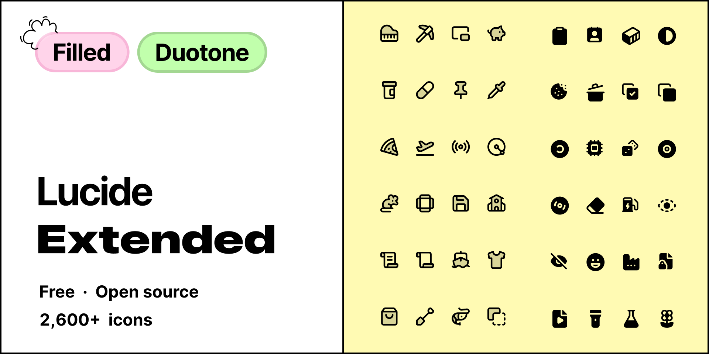

# lucide-extended-react

Filled and duotone versions of [Lucide](https://lucide.dev) icons, for React.

> Not affiliated with or endorsed by Lucide.

## Install

```sh
npm install lucide-extended-react
```

Keep `lucide-react` for the outlines. React 18 or later. ESM only.

## Usage

```tsx
import { HeartFilled, HeartDuotone } from 'lucide-extended-react'

export function Example() {
  return (
    <>
      <HeartFilled />
      <HeartDuotone size={32} color="crimson" />
    </>
  )
}
```

Each icon has its own file too:

```tsx
import HeartFilled from 'lucide-extended-react/heart-filled'
import HeartDuotone from 'lucide-extended-react/heart-duotone'
```

Only the icons you import end up in the bundle (tree-shakeable).

### Next to `lucide-react`

```tsx
import { Heart } from 'lucide-react'
import { HeartFilled } from 'lucide-extended-react'

export function LikeButton({ liked }: { liked: boolean }) {
  return liked ? <HeartFilled color="crimson" /> : <Heart />
}
```

Some Lucide icons have no filled or duotone version yet. Where the props differ from Lucide's, the table says so.

## Props

Icons take the usual SVG attributes (`className`, `style`, `onClick`, `aria-label`, and so on), plus:

| Prop | Type | Default | Applies to | Description |
| --- | --- | --- | --- | --- |
| `size` | `number \| string` | `24` | all | Width and height. |
| `color` | `string` | `'currentColor'` | all | Fill on filled icons. Outline on duotone icons. |
| `secondaryColor` | `string` | the value of `color` | duotone | Colour of the backing shape. |
| `secondaryOpacity` | `number \| string` | `0.15` | duotone | Opacity of that shape. |

`strokeWidth` and `absoluteStrokeWidth` are accepted, so Lucide-shaped props type-check. Both are ignored. Duotone outlines stay at 2.

Filled icons have no `secondaryColor` or `secondaryOpacity`.

`ref` goes to the `<svg>`. Every icon has the classes `applifted-icon` and `applifted-icon-<name>`, for example `applifted-icon-heart-filled`.

### Accessibility

Icons are decorative by default, with `aria-hidden="true"`. Pass `aria-label` or `aria-labelledby` when an icon needs a name. `aria-hidden` is then left off.

```tsx
<HeartFilled aria-label="Liked" />
```

## Naming

The Lucide name in PascalCase, then `Filled` or `Duotone`.

| Lucide name | Filled | Duotone | Deep import |
| --- | --- | --- | --- |
| `heart` | `HeartFilled` | `HeartDuotone` | `lucide-extended-react/heart-filled` |
| `circle-check` | `CircleCheckFilled` | `CircleCheckDuotone` | `lucide-extended-react/circle-check-duotone` |

## Icons

- **1,387** filled
- **1,242** duotone

An icon can have one style without the other.

## For agents

Search [`icons.json`](./icons.json) before choosing a component. It is the full catalogue, so search it rather than reading it from top to bottom. Each entry has the Lucide `name`, a `label`, `tags`, `categories`, `aliases`, `useCases`, and the `variants` this package ships (`filled`, `duotone`). `components` gives the exact export for each variant.

`heart` is `HeartFilled` and `HeartDuotone`. An icon can have one variant without the other. If the requested variant is missing, say so.

The same file is included in the published package.

## Planned

Coming soon:

- A Figma file with icon components
- A powerful search
- A Raycast extension

## Licence

ISC. See [LICENSE](./LICENSE) and [NOTICE](./NOTICE).

The shapes are derived from [Lucide](https://github.com/lucide-icons/lucide) (ISC). Some of those are derived from [Feather](https://github.com/feathericons/feather) (MIT). Both notices are in the licence.

## Contributing

Icons are added as SVGs. The steps are in [CONTRIBUTING.md](./CONTRIBUTING.md).
